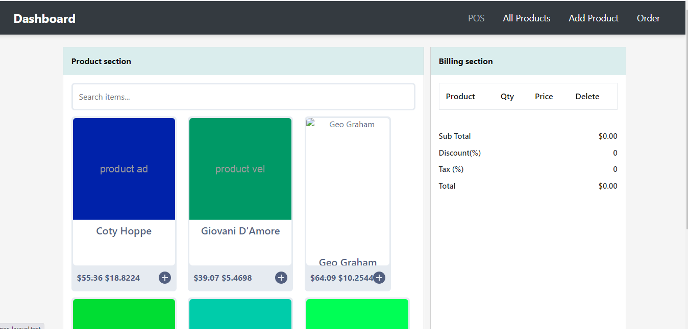

### This Project for job test. 
<p align="center"><a href="https://laravel.com" target="_blank"></a></p>
=======
# Pos Laravel
>>>>>>> 960858a7c24e6b04928208d8358a5c0f78490a4e

## About

This is laravel based simple POS system with product add and order show and more various features include this project

## Requirements

- PHP ^8.2
- Composer
- Laravel ^11.9
- MySQL

## Installation

1. **Clone the repository:**

    ```bash
    git clone https://github.com/devmojahid/pos-laravel.git
    cd pos-laravel
    ```

2. **Install dependencies:**

    ```bash
    composer install
    ```

3. **Copy the `.env` file and set up your environment variables:**

    ```bash
    cp .env.example .env
    ```

    Open the `.env` file and update the necessary settings, such as database credentials.

4. **Generate an application key:**

    ```bash
    php artisan key:generate
    ```

5. **Run the migrations:**

    ```bash
    php artisan migrate
    ```

6. **Seed the database:**

    ```bash
    php artisan db:seed
    ```

## Running the Project

1. **Start the development server:**

    ```bash
    php artisan serve
    ```

    The application will be available at `http://localhost:8000`.

**You can also use laragon:**